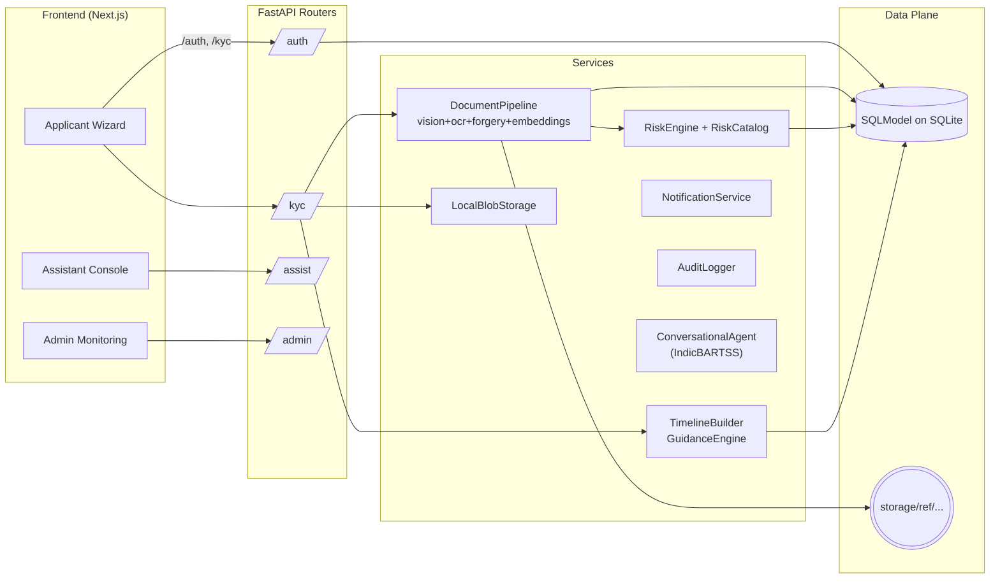

# **Saral-KYC: Simple. Secure. Seamless.**

## **Concept Overview**

**Saral-KYC** reimagines KYC as an _AI-first, compliance-aware orchestration system_ that automates end-to-end onboarding while preserving transparency, fairness, and auditability. It unifies **multimodal AI**, **large language models (LLMs)**, and **risk intelligence graphs** to deliver a _trustworthy, scalable, and explainable KYC pipeline_ for banks and financial institutions.

----------

## **Core System Architecture & Automation Design**

The Saral-KYC architecture operates as a **multi-layered AI orchestration pipeline** combining document intelligence, entity analytics, and compliance reasoning — optimized for both _accuracy_ and _regulatory transparency_.

1.  **Document Intelligence & Data Extraction:**  
    Incoming documents (Aadhar, PAN, utility bills, etc.) pass through a _multimodal preprocessing pipeline_ that detects type, orientation, and authenticity before extraction.
    
    -   **Vision Transformers (Donut / DocFormer):** Perform layout-aware parsing of IDs, extracting key-value pairs directly from images.
        
    -   **OCR + NER Hybrid Layer:** Handles non-standard document layouts using OCR text fed to a transformer-based _Named Entity Recognition_ model fine-tuned for Indian KYC fields.
        
    -   **Forgery & Liveness Verification:** CNNs detect tampering (compression artifacts, edge mismatches) while 3D face depth estimation confirms selfie liveness and cross-matches with document photos.
        
    -   **Cross-Document Validation:** Sentence-BERT embeddings compare extracted entities across documents, identifying inconsistencies in names, addresses, or ID details.
        
2.  **AI-driven Risk & Anomaly Detection:**  
    Verified entities feed into a _Risk Intelligence Graph_, mapping relationships between users, addresses, and connected accounts.
    
    -   **Graph Neural Networks (GNNs):** Detect relational anomalies such as synthetic identities or fraud clusters.
        
    -   **LLM-based Behavior Understanding:** Analyzes free-text statements or user chats to infer intent, cooperation, and risk sentiment.
        
    -   **Dynamic Risk Scoring Engine:** Combines document authenticity, entity consistency, and behavioral trust into a composite _KYC Risk Index_, aligned with FATF/AML guidelines. Scoring rules are version-controlled for audit readiness.
        
3.  **Explainability, Governance & Compliance Integration:**  
    Each model decision generates an _XAI metadata packet_ containing SHAP explanations, decision rationale, and applied regulatory rule IDs.
    
    -   A _Regulatory Logic Engine_ dynamically aligns actions with RBI/AML policies via rule-sync APIs.
        
    -   Continuous _model monitoring_ tracks fairness, accuracy, and drift — auto-triggering retraining pipelines when thresholds are breached.
        
    -   An _immutable audit ledger_ logs every decision, ensuring end-to-end traceability.
        
4.  **Human Oversight & Feedback Loop:**  
    Ambiguous cases are escalated with AI-generated rationale summaries for manual verification. Human verdicts reinforce retraining datasets, enabling a _self-improving governance framework_.
    

----------

## **Innovation**

-   **Conversational LLM Orchestrator:** Guides customers contextually, providing multilingual clarifications and dynamic document assistance.
    
-   **Adaptive Fairness Checks:** Differential performance monitoring ensures unbiased decisions across user segments.
    
-   **Real-time Reg-Tech Sync:** Policy updates auto-reflect in decision logic through modular rule APIs.
    

----------

## **Impact**

-   **Efficiency:** 70% reduction in manual verification time and near-instant approval for low-risk profiles.
    
-   **Compliance:** Full explainability and auditable decisions reduce regulatory risk.
    
-   **Scalability:** Cloud-native microservices integrate easily with legacy banking systems.

----------

## Platform components

- **FastAPI backend (`app/`)** — exposes auth, KYC workflow, admin, and assistant APIs. Core services (`services/`) cover document parsing, liveness, guidance, notifications, and the risk engine. Config and security knobs live in `app/core`.
- **Data tier** — SQLAlchemy models map to `saral_kyc.db` (SQLite by default) via `app/db`. Model bundles (Donut, MiniFASNet, IndicBARTSS) are stored under `app/models_data` and loaded lazily through `services/ml_clients.py`.
- **Next.js frontend (`frontend/`)** — applicant wizard, risk dashboard, admin console, and conversational assistant built with App Router, Tailwind, and shadcn/ui primitives.
- **Automation & QA** — `scripts/download_models.py` primes heavy weights, while `tests/` covers document processing, workflows, risk scoring, and the chat surface.

## Repository layout

```
.
├─ app/                # FastAPI application, services, schemas, models
│  ├─ api/             # Versioned routers and dependency wiring
│  ├─ core/            # Settings, middleware, logging, security helpers
│  ├─ services/        # Document pipeline, risk engine, assistant, storage
│  ├─ db/              # Session management and DB bootstrap
│  ├─ models/          # SQLAlchemy entities (user, workflow, audit, risk)
│  └─ schemas/         # Pydantic contracts for IO
├─ frontend/           # Next.js 13 workspace (app router + UI components)
├─ scripts/            # Utility scripts (model download, seeding)
├─ storage/            # Sample uploads organized per application
├─ tests/              # Pytest suites for APIs and services
└─ requirements.txt    # Backend dependencies
```

## Processing pipeline



## Local development & runbook

1. **Prerequisites**
   - Python 3.10+ with `pip`, Node.js 18+, and Git.
   - (Optional) Create a virtual environment to isolate backend deps.

2. **Backend setup**
   ```bash
   python -m venv .venv
   source .venv/Scripts/activate        # use .venv/bin/activate on macOS/Linux
   pip install -r requirements.txt
   cp env.example .env                  # update secrets, DB URL, model paths
   python scripts/download_models.py    # fetch Donut + MiniFASNet checkpoints
   python -m app.db.init_db             # bootstrap SQLite with seed data
   uvicorn app.main:app
   ```

3. **Frontend setup**
   ```bash
   cd frontend
   cp env.example .env.local            # set NEXT_PUBLIC_API_BASE_URL
   npm install
   npm run dev
   ```

4. **Suggested extras**
   - Run `pytest` before shipping changes.
   - Delete `saral_kyc.db` to reset demo data or point `DATABASE_URL` to Postgres.
   - Store uploaded docs under `storage/` (the FastAPI services expect this layout).

The backend serves on `http://127.0.0.1:8000` by default, and the frontend dev server renders at `http://localhost:3000`, proxying API calls via `NEXT_PUBLIC_API_BASE_URL`.
