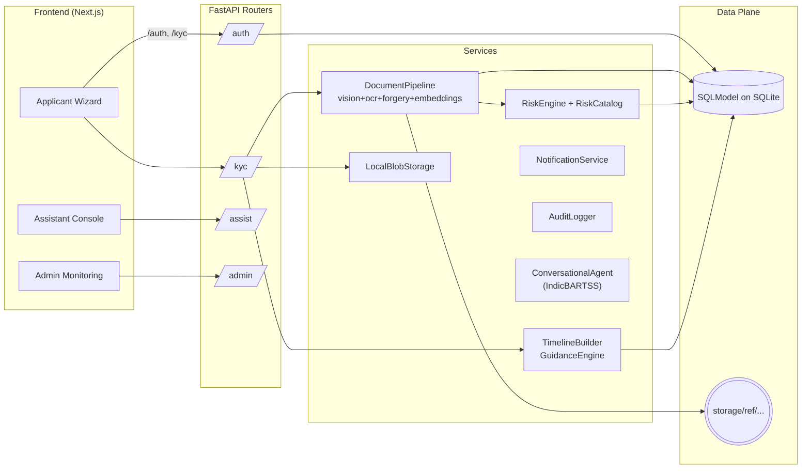

# Saral-KYC: Simple. Secure. Seamless.

### 1. Introduction

Saral-KYC automates the entire Know Your Customer journey with an AI-first FastAPI backend and a Next.js applicant/admin experience. Applicants create profiles, upload documents, run selfie liveness, and receive multilingual assistance, while ops teams get anomaly-aware risk scoring, escalation guidance, and full audit trails. Every step—document ingestion, verification, risk assessment, and nudging—is orchestrated to shorten onboarding time without relaxing compliance.

---

### 2. Technology Stack

- **Backend:** Python 3.10, FastAPI, SQLModel/SQLAlchemy, Pydantic, Uvicorn, structlog, Passlib (bcrypt), cryptography, langdetect, httpx, python-multipart, asyncio BackgroundTasks.
- **Frontend:** Next.js 14 App Router, React 18, TypeScript, Tailwind CSS, shadcn/ui (Radix primitives), lucide-react icons, next-themes, custom AppShell/layout, client-side auth context with localStorage-backed tokens.
- **AI/ML libraries:** Hugging Face transformers (Donut DocVQA, IndicBARTSS, Cardiff NLP XLM-R sentiment), torch, sentence-transformers (all-MiniLM-L6-v2), EasyOCR, spaCy `en_core_web_md`, OpenCV + MiniFASNet V2, networkx (graph signals), langdetect.
- **Infrastructure / DevOps:** `scripts/download_models.py` to hydrate Donut/SpaCy/MiniFASNet weights, `.env` driven configuration via `pydantic-settings`, Uvicorn for the API, Next.js dev/build scripts, pytest for regression coverage, structlog JSON logs with PII masking.
- **Databases / Storage:** SQLite (`saral_kyc.db`) through SQLModel ORM, filesystem-backed `LocalBlobStorage` under `storage/<reference>/<doc_type>/<id_filename>` for raw files, model bundles under `app/models_data`.

---

### 3. System Architecture

- **Core services:** `app/api/v1` exposes routers for auth, KYC, admin monitoring, health, and the assistant. Each router composes dedicated services (`DocumentPipeline`, `RiskEngine`, `AuditLogger`, `TimelineBuilder`, `NotificationService`, `GuidanceEngine`) so business logic stays outside HTTP handlers.
- **API flow:** an applicant calls `/kyc/applications` to create a draft, uploads documents/liveness to `/documents` and `/liveness`, completes submission, and optionally triggers `/risk/assess` or `/risk/status`. Background tasks (`_process_document_task`) can process files asynchronously when `doc_enable_async_processing` is toggled.
- **AI integration:** `DocumentPipeline` orchestrates Donut-based vision parsing, EasyOCR + spaCy NER, SentenceTransformer embeddings, and MiniFASNet/OpenCV forgery checks before persisting authenticity, liveness, anomaly flags, and full `model_trace` blobs back to `DocumentArtifact`.
- **Risk and workflow:** `RiskEngine` consumes documents + optional customer statements, fuses graph, behavior, and ensemble metrics, stores `RiskDecision`, and feeds `derive_risk_category` for quick status lookups. `GuidanceEngine` generates escalation summaries; `TimelineBuilder` folds documents, risk decisions, review tasks, and notifications into applicant-visible timelines.
- **Async + queues:** Uploads run synchronously by default but can offload to FastAPI `BackgroundTasks`, reloading documents inside a new DB session before calling `DocumentPipeline.analyze_stored_document`.
- **Auth/session handling:** Bearer tokens reference persisted `UserSession` rows. Dependencies such as `get_current_user` and `get_current_admin` gate applicant-only and admin-only routes, while optional dependencies allow unauthenticated read flows (e.g., application creation).
- **Assistant surface:** `/assist/chat` and `/assist/chat/stream` summarize KYC context (`documents`, `notifications`, `risk history`) before handing the prompt to the IndicBARTSS-backed `ConversationalAgent`, returning streaming chunks with custom headers (model, backend, token counts).

---

### 4. Data Model & Storage

- **Users & Sessions:** `User` stores email/full name/password hash plus an `is_admin` flag. `UserSession` persists issued tokens, expiry, and optional user agent, powering bearer-token auth.
- **Applications:** `KycApplication` captures applicant profile, status transitions, timestamps, and aggregates to documents, risk decisions, review tasks, and notifications. Reference IDs use `short_uuid()` to de-identify raw PKs on the frontend.
- **Documents:** Each `DocumentArtifact` records `doc_type`, `status`, `storage_path`, authenticity/liveness scores, extracted entities, anomaly flags, and rich `model_trace` telemetry for explainability. Files land in `LocalBlobStorage`, so binary data never touches the DB.
- **Risk:** `RiskDecision` rows maintain normalized scores, bands, rule version, JSON `explanation`, and a fairness report snapshot for every assessment.
- **Workflow artifacts:** `ReviewTask`, `NotificationEvent`, and `ConversationTurn` keep manual escalations, applicant nudges, and assistant transcripts auditable. `AuditEvent` (action + payload + actor) is written for creation, document uploads, nudges, escalations, and risk assessments.
- **Storage & caching:** Documents live under `storage/<reference>/<doc_type>/<doc_id>_<filename>`, while model weights stay under `app/models_data`. File downloads stream from disk via `/kyc/documents/{id}/download`, so the API never exposes the raw filesystem path.
- **Consistency & auditability:** `AuditLogger`, `TimelineBuilder`, and the persistent `model_trace` ensure every automated decision, anomaly, and human action is replayable. Transactions use SQLModel sessions with explicit commits to avoid partially written states.

---

### 5. AI / ML / Automation Components

- **DocumentPipeline (`app/services/document_pipeline.py`):**
  - Stores uploads via `LocalBlobStorage`, then either analyzes inline or via background jobs.
  - Stages: Donut DocVQA (`VisionModelClient`) for layout-aware parsing, EasyOCR + spaCy NER for textual fields, SentenceTransformer embeddings for cross-document similarity, and OpenCV heuristics blended with MiniFASNet V2 for forgery/liveness (selfie) scoring.
  - Heuristics: EXIF/timestamp drift checks, aspect-ratio + texture-based layout anomaly scoring, regex-based language detection, and entity-overlap validation. Everything is weighted via configurable stage weights and produces `DocumentInsights` + anomaly flags.
  - Telemetry: `StageOutput` captures payload snapshots, confidence, latency, metadata, and errors; `InferenceCache` avoids re-running deterministic stages on unchanged files/text.
  - Modes: `doc_pipeline_mode` can run `"mock"` for instant deterministic insights, and each stage can be toggled via settings to trade accuracy for speed.

- **RiskEngine (`app/services/risk_engine.py`):**
  - Builds `FeatureVector` aggregates (mean authenticity, coverage, doc mix, penalties, ensemble averages) from processed documents.
  - Supplements document evidence with `GraphSignalAnalyzer` (networkx degree centrality using email domain & phone clusters) and `BehaviorAnalyzer` (Cardiff NLP multilingual sentiment, with heuristics fallback), plus cross-document consistency scores.
  - Returns `RiskAssessment` that includes a weighted score, band (`low/medium/high`), SHAP-like factor list, and fairness report enumerating penalties, doc coverage, and flag counts.

- **Guidance & notifications:** `GuidanceEngine` crafts escalation summaries based on missing extraction/anomalies; `NotificationService` logs multi-channel nudges (`email/sms/in_app`) and stores metadata for the timeline.

- **Conversational assistant:** `ConversationalAgent` uses `langdetect` to infer language, enforces a keyword-based safety gate, builds templated English responses enriched with application context, and (when available) leverages IndicBARTSS for translation. Streaming endpoints chunk replies for low-latency UX, and metadata headers expose backend/model/token usage for observability.

- **Automation hooks:** Escalations (`/escalate`) flip applications to `MANUAL_REVIEW` and pre-fill AI summaries. Risk status endpoint uses `derive_risk_category` + `risk_reasons_for` to deliver rationale instantly, while `TimelineBuilder` consolidates events for applicant dashboards.

---

### 6. Security & Compliance

- **Auth & secrets:** Passwords are hashed with bcrypt (`hash_password`/`verify_password`), bearer tokens reference `UserSession` rows, and helper `EnvelopeEncryptor` (Fernet) is available for future payload encryption. Admin-only endpoints must pass `get_current_admin`.
- **Transport & session hygiene:** CORS is centrally configured, custom `RequestIDMiddleware` injects `X-Request-ID`, and `TimingMiddleware` reports per-request latency for traceability. Tokens expire per `access_token_expire_minutes`, and logout revokes sessions server-side.
- **Logging & monitoring:** `configure_logging` sets up structlog JSON output plus `_PIIMaskingFilter` that redacts long digit sequences before they hit sinks. `AuditEvent` persists every material action, while `NotificationService` keeps an in-memory and DB record of outbound nudges. Assistant endpoints add headers (model/backend/tokens) for downstream compliance review.
- **Data handling:** Documents are isolated to server-owned storage paths referenced only by `DocumentArtifact.storage_path`. Downloads go through `/kyc/documents/{id}/download`, which validates the document ID before streaming bytes (the route currently doesn’t inject auth dependencies, so the protection boundary relies on non-guessable IDs).
- **Explainability & fairness:** Each `DocumentArtifact` stores `model_trace` (stage weights, ensemble metrics, anomalies), and each `RiskDecision` stores both detailed explanations and fairness reports, satisfying audit requirements. Timelines, escalation notes, and conversation turns ensure regulators can replay every interaction.
- **Misuse prevention:** Assistant safety is enforced via keyword filtering + multilingual disclaimers, liveness checks run through MiniFASNet before approvals, and `risk_reasons_for` communicates why a case is categorized as safe/medium/high.

---

### 7. Scalability & Performance

- **Async & concurrency:** Heavy document inference runs inside `asyncio.to_thread`, and toggling `doc_enable_async_processing` moves work to FastAPI `BackgroundTasks`, freeing the request thread. Streamed assistant responses reduce perceived latency for long replies.
- **Inference efficiency:** `InferenceCache` memoizes stage outputs per file/text fingerprint; SentenceTransformer, Donut, and MiniFASNet weights are lazy-loaded and reused. Each stage can be disabled (vision/OCR/embeddings/metadata) to meet resource budgets.
- **Model packaging:** `scripts/download_models.py` caches Donut, spaCy, and MiniFASNet weights under `app/models_data`, eliminating cold-start downloads and making containerization trivial. `doc_pipeline_mode="mock"` gives instant deterministic outputs for demos/tests.
- **Resource-aware fallbacks:** Behavior and graph analyzers gracefully degrade when Hugging Face or networkx isn’t installed, ensuring the API keeps responding even on constrained hardware.
- **Frontend performance:** The Next.js wizard batches API calls, simulates upload progress, and shows per-document indicators without polling. Assistant streaming keeps sockets light via chunked text, and admin graphs render client-side SVGs instead of server-heavy canvases.
- **Testing & reliability:** Pytest suites cover document uploads, risk assessment, assistant streaming, timeline summaries, and audit creation, catching regressions before Round-2 milestones.

---

### 8. Repository Link

- GitHub: https://github.com/Abhijithreddydasari/Saral-KYC  
- Video Folder: https://drive.google.com/drive/u/2/folders/1XbEx8RMpair3nTYFYYK5ch6wqie6U5Af

