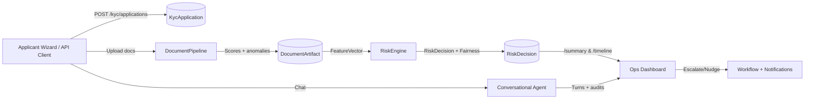

## Saral-KYC Primer
- Saral-KYC is an AI-first Know Your Customer workflow: FastAPI backend + Next.js frontend coordinate document intake, automated checks, and operator reviews.
- Data persists via SQLModel/SQLite; configurable settings live in `.env`-driven `app/core/config.py`.
- Frontend consumes the API through a typed fetch wrapper, so you can adjust base URLs without touching components.

## Backend Building Blocks
- **Entrypoint & Middleware** – `app/main.py` instantiates FastAPI, wires request ID/timing middleware, initializes the DB, and mounts every v1 router so the frontend always talks to `/api/v1/...`.
- **Configuration & DB Access** – `app/core/config.py` exposes typed settings (CORS, model weights, storage paths) while `app/db/session.py` builds a SQLAlchemy engine (SQLite by default) and hands out sessions through dependency injection.
- **Models & Schemas** – `app/models/*` define SQLModel tables for applications, documents, risk decisions, reviews, etc. Matching Pydantic schemas in `app/schemas/*` control request/response validation.
- **Routers**
  - `app/api/v1/endpoints/applications.py` handles CRUD on KYC applications, document uploads, risk assessments, escalations, nudges, summaries, timelines, and downloads.
  - `app/api/v1/endpoints/assist.py` exposes a multilingual chat assistant (bootstrap metadata + `/chat` endpoint), logging every turn for compliance.
  - `app/api/v1/endpoints/health.py` gives lightweight readiness checks.
- **Services**
  - `DocumentPipeline` orchestrates vision parsing, OCR/NER, forgery + liveness, metadata/layout/language sanity checks, and cross-document embeddings before persisting insights.
  
```
```78:158:app/services/document_pipeline.py
insights = await loop.run_in_executor(
    None,
    self._analyze_file,
    saved_path,
    doc.doc_type,
    self._historical_entities(application),
)
doc.extraction_payload = insights.extracted_entities
doc.authenticity_score = insights.authenticity_score
doc.liveness_score = insights.liveness_score
doc.anomaly_flags = insights.anomaly_flags
doc.model_trace = insights.model_trace
```

  - `RiskEngine` blends document scores, graph anomalies, behavioral sentiment, and penalties to produce an explainable risk decision plus fairness report.

```
```189:235:app/services/risk_engine.py
features = FeatureVector.from_documents(documents)
doc_score = features.doc_score
graph_score = self.graph_analyzer.score(application)
behavior_score, sentiment_label = self.behavior_analyzer.score(customer_statement)
combined = (
    0.5 * doc_score
    + 0.2 * graph_score
    + 0.15 * behavior_score
    + 0.15 * features.stage_breakdown.get("crossdoc", 0.75)
    - features.anomaly_penalty
    - features.liveness_penalty
    - coverage_penalty
    - features.metadata_penalty
    - features.language_penalty
    - mix_penalty
)
```

  - Other helpers (`services/guidance.py`, `notification.py`, `timeline.py`, `audit.py`) summarize escalations, send nudges, construct timelines, and log immutable audit trails.
- **Persistence & Storage** – Uploaded documents land in `storage/` via `LocalBlobStorage`, so everything stays on-disk for previews/downloads.

## Frontend Building Blocks
- **Framework & Styling** – Next.js 13 App Router, Tailwind CSS, and shadcn/ui components provide a modern React stack.
- **API Client** – `frontend/src/lib/api-client.ts` wraps `fetch`, automatically pointing at `NEXT_PUBLIC_API_BASE_URL` and handling JSON/FormData payloads.

```
```1:34:frontend/src/lib/api-client.ts
const API_BASE = process.env.NEXT_PUBLIC_API_BASE_URL?.replace(/\/$/, "") ?? "http://localhost:8000/api/v1";
...
const response = await fetch(`${this.baseUrl}${path}`, { ...options, method, headers, cache: "no-store" });
if (!response.ok) {
  const detail = await response.text().catch(() => response.statusText);
  throw new Error(detail || "Request failed");
}
```

- **Applicant Wizard (`src/app/wizard`)** – Three-step drag/drop uploader uses `UploadStep`, `StatusIndicator`, and `StepWizard` to call `/kyc/applications/{id}/documents`, then displays authenticity scores/flags returned by the pipeline.
- **Operations Console (`src/app/ops`)** – Loads `/kyc/applications` plus the first `/summary`, then renders `StaffDashboard` to review documents, risk explanations, timelines, and assistant chat history.
- **Shared UI** – `components/ui/*` hold Tailwind-wrapped primitives; `components/kyc/*` add KYC-specific visualizations.

## Current Pipeline (Backend → Frontend)
1. **Application Creation** – Client (frontend or testing scripts) POSTs to `/api/v1/kyc/applications`, storing applicant metadata and generating a reference ID.
2. **Document Upload & Analysis**
   - Frontend wizard POSTs form data (`doc_type`, file) to `/documents`.
   - `DocumentPipeline` saves the file, calls the configured ML clients (vision transformer, EasyOCR, spaCy NER fallback, forgery/liveness heuristics, metadata/layout/language checks), blends scores using weights from `Settings`, and stores `extraction_payload`, `authenticity_score`, `anomaly_flags`, and stage traces on the `DocumentArtifact`.
3. **Risk Assessment**
   - Operators or automation POST to `/risk/assess` with optional customer statement.
   - `RiskEngine` builds a `FeatureVector`, fuses document, graph, and behavior signals, subtracts penalties, and emits a `RiskDecision` with SHAP-like factors + fairness counters for the UI.
4. **Operational Views**
   - `/summary` composes application data, last risk decision, and a generated timeline (uploads, nudges, reviews, chat) so the ops console can show a single source of truth.
   - `/timeline`, `/documents/{id}/preview`, and `/documents/{id}/download` power the document viewers.
5. **Assistant Loop**
   - The frontend assistant bootstrap hits `/assist/session/bootstrap` to get welcome text, supported languages, and suggested prompts.
   - Conversations POST `/assist/chat`; each turn is logged (`ConversationTurn` model) and audited while the `ConversationalAgent` enforces simple language detection + safety filters.
6. **Notifications & Escalations**
   - `/nudges` writes `NotificationEvent` rows and calls `NotificationService` (currently logs/simulates email/SMS).
   - `/escalate` creates `ReviewTask` items with AI-generated summaries so human analysts can intervene.

## Pipeline Picture



## Future Contribution Ideas
- **Real ML Integrations** – Swap the placeholder `MLClientRegistry` calls with actual model servers (vision transformer, OCR, forgery/liveness detectors) and stream latencies/confidences back through `StageOutput`.
- **Authentication & RBAC** – Introduce OAuth/JWT, role-based access (applicant vs. analyst vs. admin), and per-route guards, since everything is open in the prototype.
- **Document Coverage Rules** – Expand `RiskEngine` penalties by codifying jurisdiction-specific document requirements and automatically requesting missing docs via `/nudges`.
- **Better Assistant Memory** – Persist richer context (last risk band, outstanding tasks) and integrate retrieval-augmented responses for regulations/FAQs.
- **Observability** – Pipe `TimingMiddleware` metrics plus pipeline stage traces to Prometheus/OpenTelemetry for production readiness.
- **CI & Testing** – Extend `tests/` to include frontend API contract tests (e.g., Playwright) and load tests for large document batches.

## Getting Started (Python-friendly)
- Clone repo, create a virtualenv, install `requirements.txt`, copy `env.example` to `.env`, then run `uvicorn app.main:app --reload` (backend) and `npm install && npm run dev` inside `frontend/`.
- Use `pytest` to validate backend behavior any time you tweak services or routers.

This information should give you a fair amount of idea of the pipeline and the potential improvements that can be done implemented.