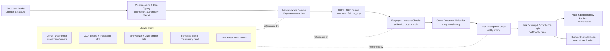

## Workflow Architecture

```mermaid
flowchart LR
    Intake[Document Intake\nUploads & capture] --> Prep[Preprocessing & Doc Typing\norientation, authenticity checks]
    Prep --> Layout[Layout-Aware Parsing\nKey-value extraction]
    Layout --> OCRNER[OCR + NER Fusion\nstructured field tagging]
    OCRNER --> Forge[Forgery & Liveness Checks\nselfie-doc cross match]
    Forge --> CrossVal[Cross-Document Validation\nentity consistency]
    CrossVal --> RiskGraph[Risk Intelligence Graph\nentity linking]
    RiskGraph --> Score[Risk Scoring & Compliance Logic\nFATF/AML rules]
    Score --> Ledger[Audit & Explainability Packets\nXAI metadata]
    Score --> Escalate[Human Oversight Loop\nmanual verification]

    subgraph Models["Models Used"]
        direction TB
        M1[Donut / DocFormer\nvision transformers]
        M2[OCR Engine + IndicBERT NER]
        M3[MiniFASNet + CNN tamper nets]
        M4[Sentence-BERT consistency head]
        M5[GNN-based Risk Scorer]
    end

    Models -.referenced by.- Layout
    Models -.referenced by.- Forge
    Models -.referenced by.- RiskGraph
```
